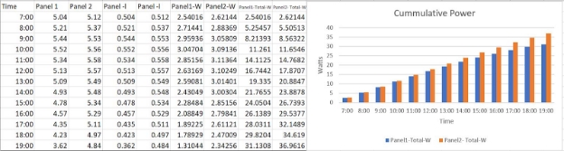

**SMART SOLAR TRACKER: Vedant Sheel**     

**Introduction:** When compared to biomass, tidal energy, wind energy, geothermal energy, and other renewable energy sources, roof mounted solar energy is a less efficient source of energy (Atomburg). This is because solar panels on a roof only face one direction, and therefore, are only exposed to a limited amount of sunlight per day, recognizing that a mounted solar panel must be positioned facing south in order to obtain the highest efficiency. This project was devised so that the solar panel tracks the maximum amount of light and directs solar panels in that direction, using Light Dependent Resistors (LDRs). 

**Purpose / Hypothesis:** This project hypothesized that a solar tracking system will produce more energy compared to a static mounted system. It is predicted a solar tracking system should produce 40% more energy than a static mounted panel. The overall objective of this project was to make more efficient use of solar panels by having the Smart Solar Tracker automatically track the direction of maximum sunlight for the greatest energy collection. 

**Components**   

1 - 4.8-6V Servo motor (Partnumber: 2730766), 2 - 12 x 7.4 x 0.6 cm Light Dependant Resistors (Part number: GL5516 -EK1412C), 2 - 13cm x 15cm 5v 500mA  Solar panel (Part Number: B08JGYVMV5), 2 - 1K Ohm resistors, Arduino Uno R3, 1 - 16.51 x 5.49 x 0.99 cm breadboard, 13 - jumper wires, 1 - 35.5cm x 8mm knitting needle, 4 - mechanical screws and nuts, culus listed soldering kit, Black+Decker drill, 1 - 17/64” drill bit, 1 - 6/32” drill bit, Home Handyman hot glue gun, 4 - 4” hot glue sticks,  6 - 2 ½” mechanical screws and nuts, 20 - ¾” wood screws, 1 - 28cm x 34cm x 1.4cm drywall, 2 - 13cm x 31.5cm x 1.4cm drywall, 50cm x 50cm cardboard paper (to cover drywall), 1 - 16cm x 6.5cm x 5cm styrofoam, 2 - 16cm x 6.5cm x 0.25cm hobby 

wood, 2 - 16cm x 5cm x 0.25cm hobby wood, 2 - 8.5cm x 4cm hobby wood, 2 - 8cm x 4cm cardboard, 20cm double sided tape, 15cm electrical tape. 

**Procedure:** This project is divided into 3 parts: 

1. Building the Smart Solar Tracker:  The first step was to construct a strong structure to mount the solar panel. Construction started with a 28cm x 34cm x 1.4cm horizontal base, with two 13cm x 31.5cm x 1.4cm long arms mounted on the side edge of it with a rod passing through the arms where the solar panel can be attached. Drywall was chosen for the base and arms because it is efficient, and strong enough for the job, and this was covered with cardboard paper. The two long rectangular arms were placed on the side edge of the platform and were reinforced with wood screws with two L-shaped corner braces on both the edges and under the platform. Additional reinforcement was provided by placing one additional L-shaped brace at the center from inside.  A rectangular lightweight base was chosen for the solar panel to rest upon. A styrofoam box glued with hobby wood around it, with an 8mm hole drilled through the middle of the rectangular box was built. An 8mm hole from the top centre of both arms that are aligned were also drilled for a rod (8mm knitting needle) to pass through with a rectangular box resting at the middle. The servo motor was mounted 2cm under the knitting needle using screws and nuts. Two pieces of cardboard (8cm x 4cm) were used to mount the LDRs on the top of each cardboard using hot glue. The two LDR legs were passed to the bottom of cardboard and were stuck to both ends of the short side of the solar panel such that both LDR’s are sticking out of the panel. The solar panel was mounted onto the box with double sided tape such that it lay flat on the knitting rod facing up. The servo motor accessories that came with the servo motor were glued on an 8.5cm x 4cm piece of hobby wood and were connected to the servo shaft. A 4cm x 0.25 cm wooden rod was taped 

   to the end of the wood. Another 8.5cm x 4cm of hobby wood was used to connect the rectangular base of the solar panel to the wooden rod using hot glue and electrical tape. For the circuit, each LDR was connected in series with 1K Ohm resistance. +5V from the Arduino Board and Ground (GND) were used as a power supply. The 2nd leg of each LDR that was also connected with 1K Ohm resistance was brought to the Arduino Board as an analog input A0 and A1 respectively. Servo was provided +5V, GND and control pin was connected to Pin9 of the Arduino Board. 

2. Finding Component Values:  This project used Arduino Software to command the components. To use the components efficiently and use software logic, the range of control components and sensors needed to be determined first. Two separate computer programs were written for the purpose. The first program was to find the range of each LDR. As indicated earlier LDR1’s value can be read at analog input 0 (A0) and LDR2 at A1. These were declared in the program as variables.  Another variable called "difference" was added to the program which was the difference between the two LDR’s. Next, a serial monitor with a baud rate of 9600 was initiated. This Arduino feature displayed the LDR values on the computer screen. There was a 

   2\.5 second delay introduced between the next set of readings in the program. Intense light (using a flashlight) was shone over each LDR, one at a time, to obtain the highest value. The lowest value was determined by completely covering the LDR so there was no light exposure. A second program was written to determine the range of the controlling component, the “Servo motor”. This was done by calling the function "Servo.h" from the Arduino library in the code. This program was created to find the range in which first defined to the Arduino board that the servo motor was attached to Pin 9. A third variable named "servoPos" was used to command the control servo shaft position angle. Finally, various values were assigned to the variable 

   "servoPos" to obtain the motor's maximum, minimum, and center values.  Maximum and minimum values are the values beyond which the motor will start stalling and will not move even when commanded to do so in the program. 

   Observations: LDR1’s range was found to be from 75-1000 and LDR2’s range was from 0-500. The motor’s maximum rotation was from 145 degrees to 20 degrees, and the center position where the solar panel was flat, was 67.5 degrees. 

3. The Final Program to Rotate the Solar Panel: Once the range of components was identified the final program was written. The "Servo.h" library was first included in the program. The Servo motor was named as "VedantServo,". Variables named "ldrE" and "ldrW" were created for the "A0" and "A1" pins, respectively. A variable called "pos" which is servo position was added and set to an initial value of 67.5 degrees, the centre position of the solar panel in the design. The program then declared two additional variables, “EastValue” and “WestValue”. “EastValue” is equal to “ldrE” and “WestValue” is equal to (“ldrW” + 500); From the observations on the range of LDR, the West LDR was 500 counts less than East. In order to balance the range, West LDR needed balance by 500 counts. The program now found the difference between “East Value” and “West Value” and would increase or decrease the servo position (thereby moving the position of Solar Panel) until both counts were equal.  When the light source was applied, the counts changed every second so the motor was constantly moving. A new constant was introduced as “tolerance”, and a value of 20 was chosen. This was found to be optimal using trial and error within the code. This change to the program had the Servo change position only if the difference in the count between the East and West LDR was greater than 20. This provided stability to the position and the motor was no longer constantly moving. 

   **Further Testing:** An identical solar panel was purchased and placed at 45 degree angle. Two identical circuits were made by connecting two 5.6K Ohms 1 watt resistors with 5% tolerance to test the hypothesis. Both solar panels were placed adjacent to each other, facing the sun, the new one fixed and the other from the original solar tracker project. The two 5.6K Ohms resistance circuits were each connected to the two solar panels. (+5V & Gnd). Two crock clips were connected at a centre of both resistances to measure the voltages for both solar panels. The voltages from both panels were observed at one hour intervals from 7:00 a.m. to 7:00 p.m. on April 24th. It was a sunny day and a cloudy night as shown below. I called Static Panel as Panel 1 and Solar Tracker as Panel 2 with the results below: 

The Solar Tracker produced 18.7% more power than a fixed solar panel. Wattage was not deducted to account for the power consumed by the Servo Motor. 

**Conclusion:**  The initial hypothesis was incorrect. The solar tracker did not produce 40% more energy than a static mounted panel. If this was used on a larger scale on a bigger panel, the efficiency should improve closer to 20 to 25%.  The Smart Solar Panel was able to achieve 18.7% greater efficiency at a fairly minimal cost. In conclusion the Smart Solar Panel produces more energy than a fixed solar panel. 

**Acknowledgements:**  Special thanks to the Bluewater Science Fair committee, and my family for helping me purchase the components. 

**References:** 

|Team, Atomberg Editorial, and Atomberg Editorial Team. “Top 10 Renewable Energy Sources.” |
| - |
|*Atomberg*, 31 Aug. 2020, <https://atomberg.com/top-10-renewable-energy-sources/>. |
|**Bibliography:** |
|James, B., Dejan, Suyi, M., Sabith, Bart, Nedelkovski, D., & Anand. (2022, February 17). *How* |
|*to control servo motors with Arduino - Complete Guide*. How To Mechatronics: |
|[https://howtomechatronics.com/how-it-works/how-servo-motors-work-how-to-control-servos-usi](https://howtomechatronics.com/how-it-works/how-servo-motors-work-how-to-control-servos-using-arduino/)|
||
|[ng-arduino/](https://howtomechatronics.com/how-it-works/how-servo-motors-work-how-to-control-servos-using-arduino/) |
|WatElectronics. *Light dependent resistor (LDR) - working principle and its applications*. |
|WatElectronics.com 6 September 2021: |
|<https://www.watelectronics.com/light-dependent-resistor-ldr-with-applications/> |
||
|**Bibliography Digital Videos:** |
|“Sun Track Solar Panel.” *YouTube*, YouTube, 7 Feb. 2018: |
|<https://www.youtube.com/watch?v=Vn4UgG-iBRA> |
||
|“LDR with Arduino - Measure Light Intensity Using Photoresistor.” *YouTube*, YouTube, 15 Oct. |
|2019, <https://www.youtube.com/watch?v=qKku-mmwNIA> |
|mcwhorpj. “[Https://Www.youtube.com/Watch?v=Vn4UgG-IBRA](https://www.youtube.com/Watch?v=Vn4UgG-IBRA).” *YouTube*, YouTube, 27 Aug. |
|2019: <https://youtu.be/WMkN-uHd-Xo> |
|mcwhorpj. “Arduino Tutorial 30: Understanding and Using Servos in Projects.” *YouTube*, |
|YouTube, 1 Oct. 2019: <https://youtu.be/aFHu65LiFok> . |

30 April 2021  Vedant Sheel: Smart Solar Tracker  Page 6** of 6** 
